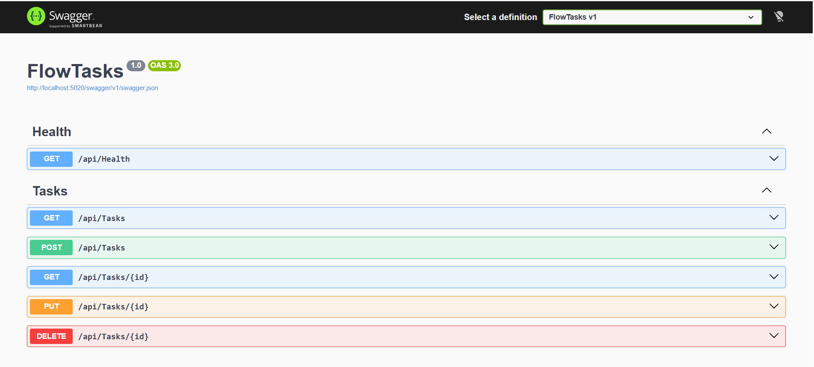

# ✅ FlowTasks API

A professional **Task Management REST API** built with **ASP.NET Core**, **Entity Framework Core**, and **SQL Server**.

This project demonstrates strong backend fundamentals including clean API design, database integration, validation, async operations, and global error handling.

---

## 🧠 Why this project matters

FlowTasks was built to demonstrate how a real-world backend system should:
- Handle data safely  
- Enforce validation rules  
- Separate concerns using DTOs  
- Respond consistently to errors  
- Remain clean, maintainable, and scalable  

It represents a strong foundation for production-grade APIs.

---

## ⚙️ Tech Stack

- ASP.NET Core Web API  
- Entity Framework Core  
- SQL Server  
- C#  
- Swagger (OpenAPI)  

---

## 📸 API Preview (Swagger)




## ✨ Features

- Full CRUD operations for tasks  
- Clean RESTful endpoints  
- DTOs for request/response separation  
- Input validation  
- Async endpoints using async/await  
- Global exception handling middleware  
- SQL Server persistence with EF Core  
- Swagger UI for API documentation  

---

## 📂 Example Endpoints

- `GET /api/tasks` → Get all tasks  
- `GET /api/tasks/{id}` → Get task by id  
- `POST /api/tasks` → Create new task  
- `PUT /api/tasks/{id}` → Update task  
- `DELETE /api/tasks/{id}` → Delete task  

---

## ▶️ How to Run the Project

1. Clone the repository:
   ```bash
   git clone https://github.com/walidmohmmedce-lgt/FlowTasks.git
2. Open the solution in Visual Studio
3. Ensure SQL Server Express (or SQL Server) is installed
4. Configure your connection string in:
   appsettings.json
5. Run database migrations:
   dotnet ef database update
6. Run the project and open Swagger:
   https://localhost:xxxx/swagger

📄 Purpose of the Project
This project was built to:
Strengthen backend development fundamentals
Practice REST API best practices
Apply validation and error handling patterns
Demonstrate readiness for junior backend roles

👤 Author

Walid Mohmmed
.NET Backend Developer
GitHub: https://github.com/walidmohmmedce-lgt

LinkedIn: https://www.linkedin.com/in/walid-mohmmed-8333583a3
